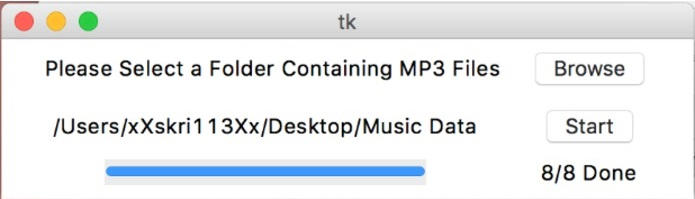
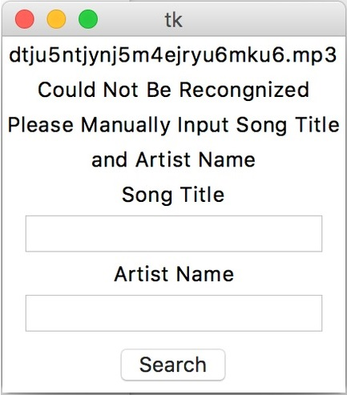

# LyricalTag

Lyrical Tag is built for the purpose of gathering more information of a .mp3 file. When the folder containing songs is selected, it scans through a list of songs to check existing properties, then it adds more information such as the album cover, track number, release date, and lyrics by using the song title and artist name to search for the additional information from gracenote and PyLyrics’ api. Then it adds the properties into the .mp3 file. If the song selected doesn’t have the properties required for the search (song title and artist name), then the program will take the .mp3 file name to check if it contains the song name and artist name. If the .mp3 file’s name doesn’t contain song and artist name either, then the program will ask the user manually input the song title and artist name for the searching process. Once the process is finished, the program will add the new properties of the song to the existing .mp3 file. Now, you will have a much more organized music library!

## Requirements

* Python 3 (any version will do)
* [PyLyrics](https://pypi.org/project/PyLyrics/)
* [Pillow](https://pillow.readthedocs.io/en/stable/)
* [TinyTag](https://pypi.org/project/tinytag/)
* [Mutagen](https://mutagen.readthedocs.io/en/latest/)

## Installing

To be added...

## Insructions

To be added...

## Screenshots

</img>
 
</img>

## Built With

* Python 3

## Author(s)

* Jim Wang
* Bob Huang
* Kevin Huang
* Richard Zhang
